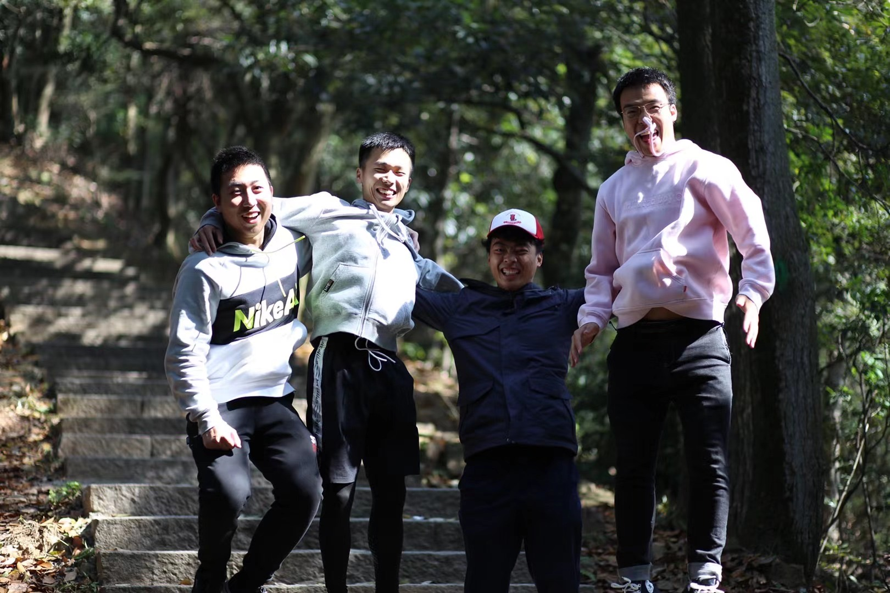
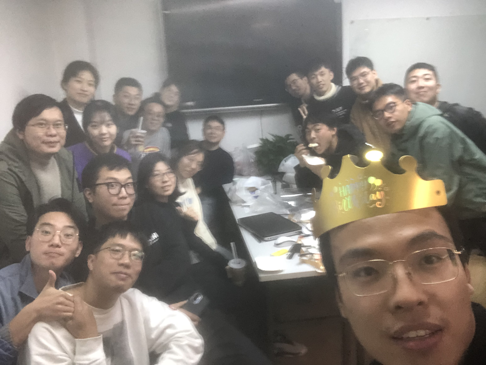
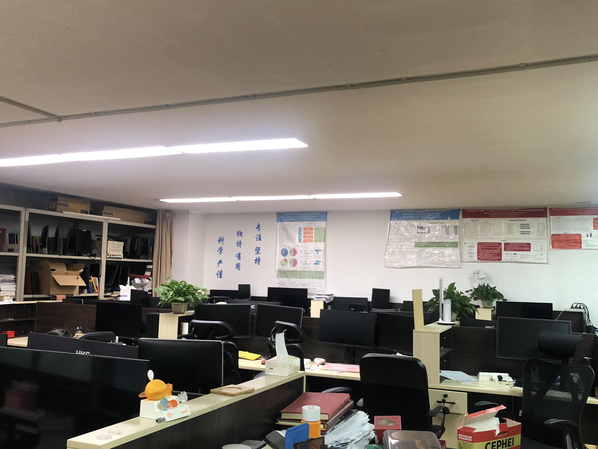
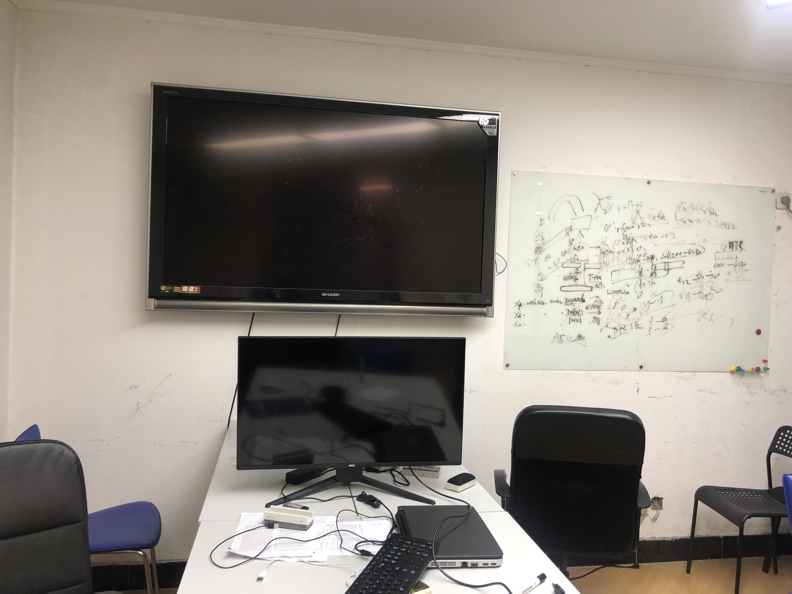

---
hide:
  - navigation # Hide navigation
---

# 其他信息

## 实验室设备
实验室拥有20余台服务器和GPU工作站以及一批支撑普适计算和人机交互研究的先进设备。

## 实验室活动

### 爬山采风

### 春游

### 秋游

### 同学庆生

## 实验室环境
### 办公环境
 

### 会议室环境
 

### 外部环境
 